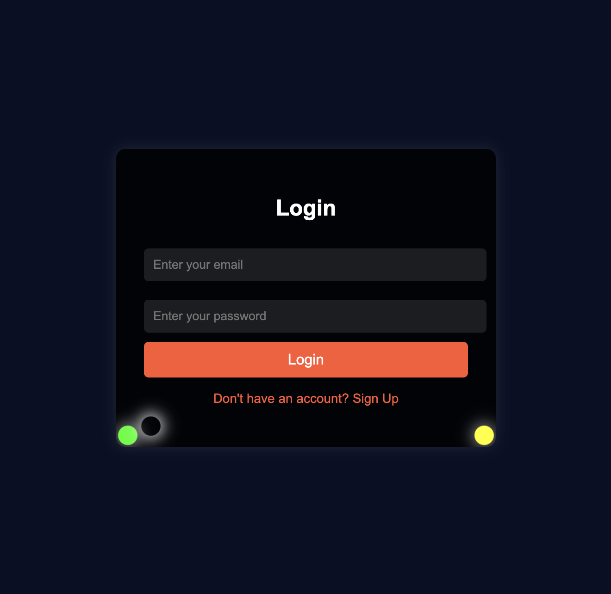

# Day 13 🔐 Login & Signup Form with Animated UI

This project is a **modern login & signup form** with a **beautiful UI, animated corners, and a dark theme**. It includes a **signup button that switches to the signup form**.  

## ✨ Features
- 🖌 **Dark blue background with transparent form**
- 🎨 **Colorful animated corners**
- 🔄 **Smooth page transition between Login & Signup**
- 🔗 **Single-page UI with placeholders for real authentication**
- 📱 **Responsive design for mobile & desktop**

### 🛠️ Technologies Used
- HTML
- CSS (with transitions for smooth effects)
- JavaScript (for toggling answers)

---

# Demo page

Click [Here](https://ayshasanyang.github.io/Day-13-login-form/) to view the page

## 🚀 How to Run
1. Download or clone the repository
```bash
git clone https://github.com/ayshasanyang/Day-13-login-form.git
```
2. Navigate to the project folder.
3. Open the project files in your vscode or any code editor of your choice
4. Open the `index.html` file in your web browser.

---

## 📸 Preview


---

## 📢 Connect

If you enjoyed this project, let me know! Follow me on social media to see more coding content:

- Instagram: [@codewithaysha](#)
- TikTok: [@Aysha](#)
